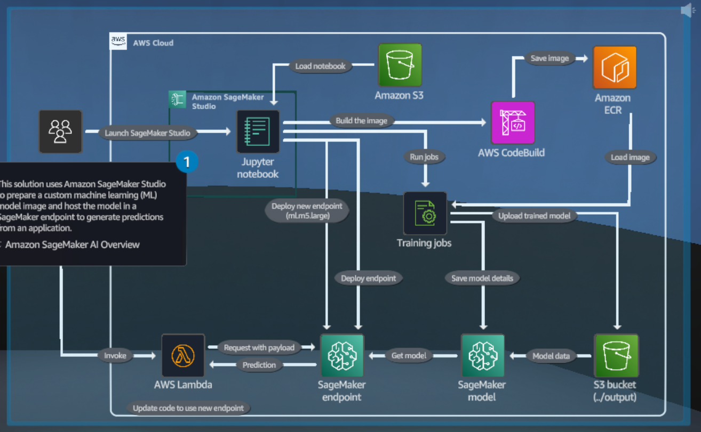

# Quest endpoint code 

This folder contains the code of the AWS skill builder Quest lab "Bring your owm model (BYOM)" from the Machine Learning Island. 

## Lab description :

Create a Docker image of the ML code, upload the image to amazon ECR, and then train and deploy you model by using Amazon Sagemaker AI 

## Usage :

This code can be reused to better the deployement of our WeatherIQ Gencast model on a Sagemaker Endpoint. All the required information and documentation can be found in the Notebook byom_regression. 

## Lab architecture :

