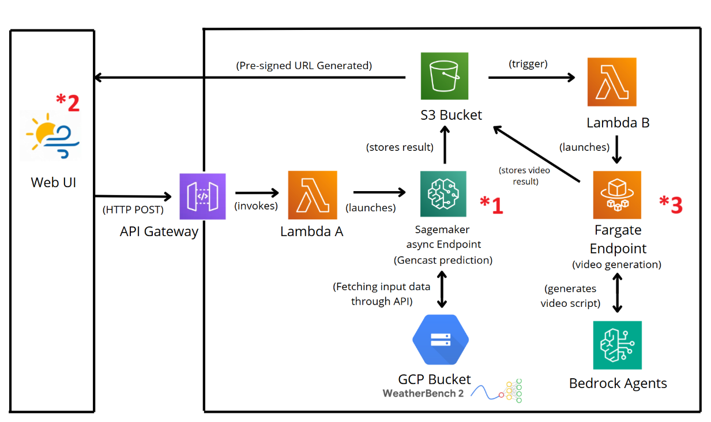

# WeatherIQ

This project explores and demonstrates the capabilities of DeepMind’s GenCast weather prediction model.  

→ The goal: to develop a prototype application that generates personalized, smartphone-format weather forecast videos based on user-selected dates and locations. 

## Github Content 

| Folder                                        | Description                                                                 |
|------------------------------------------|-----------------------------------------------------------------------------|
| Gencast *1                     | Contains research, demo code, and deployment scripts related to DeepMind's GenCast weather forecasting model. It includes tools to run the model locally and on AWS SageMaker. |
| Mobile Interface *2         | Professional mobile interface for weather prediction designed specifically for offshore windfarm engineers. This application provides an intuitive way to input forecast parameters and access weather predictions powered by GenCast technology.  |
| Project Documentation               | Contains all the needed documentaton, research and project context.   |
| Quest Endpoint code          | Contains the code of the AWS skill builder Quest lab "Bring your owm model (BYOM)" from the Machine Learning Island. This code can be reused to better the deployement of our WeatherIQ Gencast model on a Sagemaker Endpoint.                   |
| Video Generation *3 | contains the code for generating weather forecast videos using the 72-hour GenCast prediction data. The output is a video that visualizes the predicted weather conditions and the generated power over an offshore windfarm for selected dates. |

## Project Architecture

